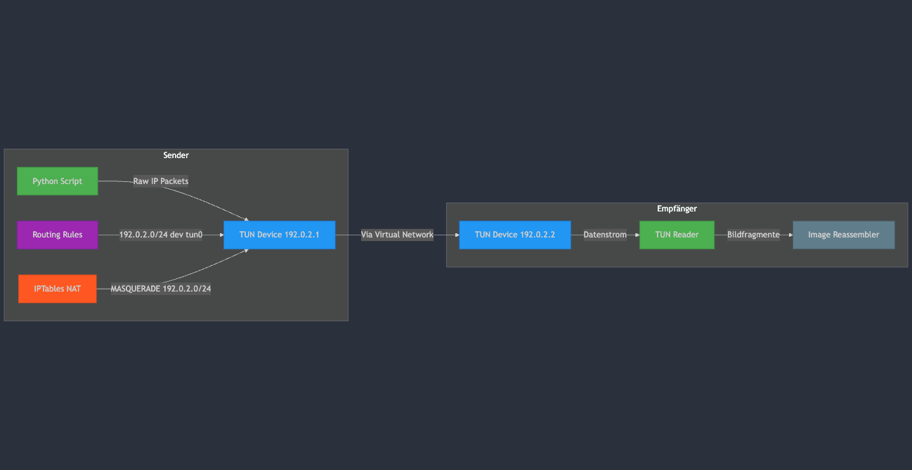

# TUN/TAP Python Demo Project


A demonstration project for working with TUN/TAP interfaces in Python using Docker. Ideal for network programming experiments and VPN prototyping.

## To Dos:

- [x] Schreibe ein TUN Sender der in tun im byte format schreibt -> ausgangspunkt die empfangenen samples vom sdr in ip paket parsen und reinschreiben
- [x] Logik schreiben die einen Frame korrekt mit IP Daten befüllt
- [x] Kanalcodierung hinzufügen

## 🌟 Features
- Creates virtual TUN interfaces in Docker containers
- Sends/receives custom ICMP packets
- Configures network routing and iptables rules
- Real-time packet monitoring with tcpdump
- Cross-platform compatibility via Docker

## ⚙️ Configuration

<div style="text-align: center;">
  
</div>

## 📋 Prerequisites
- Docker 20.10+
- Linux host (recommended) or Docker Desktop with Linux containers
- Administrative privileges for Docker operations

## 🛠️ Build & Run

### 1. Delete Existing tun-python Image (Optional)

```bash
docker rmi $(docker images tun-python:latest -q)
```

### 2. Build the Docker Image


```bash
docker build -t tun-python .
```

### 3. Start the Container

```bash
docker run --rm -it \
  --cap-add=NET_ADMIN \
  --cap-add=SYS_ADMIN \
  --sysctl net.ipv4.ip_forward=1 \
  --sysctl net.ipv4.route.flush=1 \
  --sysctl net.ipv6.conf.all.disable_ipv6=1 \
  --device /dev/net/tun \
  -v $(pwd)/data:/app/data \
  -v $(pwd)/logs:/var/log \
  tun-python
```